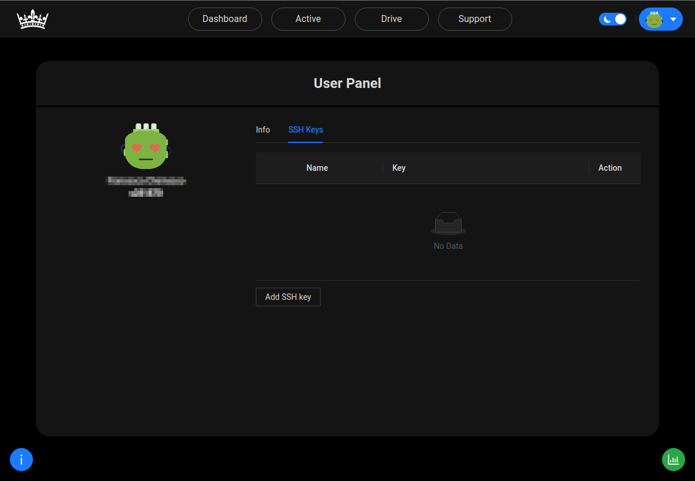
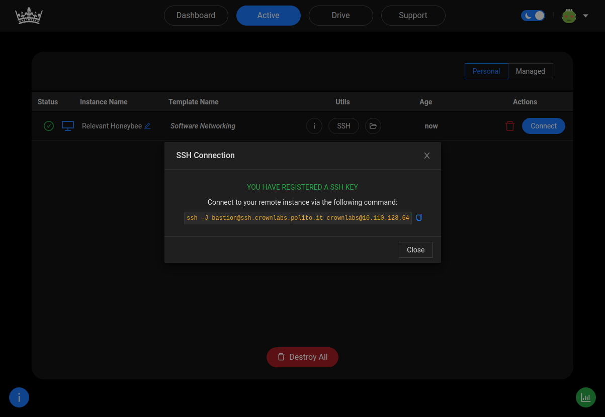

+++
fragment = "content"
#disabled = true
date = "2021-11-12"
weight = 100
# title = "Connecting to CrownLabs with SSH"
+++

## Introduction

**CrownLabs** allows users to access their VMs through a local SSH client (i.e., executed on their local machines).

This guide shows how to generate a SSH key pair on your operating systems (Windows, Linux, MacOS), how to load it on **CrownLabs** and access your **CrownLabs**' VM using SSH from a local terminal.

Note that the **generation** of the **SSH key pair** and the upload of the **SSH public key** does not have to be repeated each time you create a new **VM**.
This process only needs to be done once per **device.**

## How it works

All CrownLabs VMs are characterized by **private IP addresses**, and cannot be accessed directly through SSH.
As shown in the figure below, it is necessary to first establish the SSH connection through a **bastion**, which instead is publicly accessible, and then **jump** to the final destination (i.e., the VM).

This can be achieved with the `ssh -J bastion@crownlabs.polito.it crownlabs@10.1.2.3` command, in which the local **SSH client** first connects to the bastion (indeed, the **-J** option specifies a **ProxyJump**), leveraging the generated **SSH key-pair** for authentication purposes.
Specifically, the **bastion** checks the **client**'s authentication attempt using the **public key** previously uploaded to the **CrownLabs Dashboard**.

If authentication succeeds, you are then redirected to your **VM**.
Indeed, the second part of the command is the standard **user@ipadress**, where **user** is **crownlabs** (the default user on each **VM**) and **ip** is your **VM's IP address**.
The **VM** will authenticate you through your **SSH key-pair**, as the bastion previously did.
Alternatively, it might fallback to traditional password authentication (which is **crownlabs**).


## How to generate an SSH key pair

1. Open a terminal and run the following command to create a [**RSA**](<https://en.wikipedia.org/wiki/RSA_(cryptosystem)>) key pair:

   ```
   ssh-keygen
   ```

   You can use the `-b` option to specify the length (in bits) of the key, as shown in the following example:

   ```
   ssh-keygen -b 2048
   ```

2. The command will prompt you to enter the path to the file where you want to save the key. A default path and file name similar to `/home/user_name/.ssh/id_rsa` (`C:\Users\username\.ssh\id_rsa` on **windows**) are suggested in parentheses. To accept the default path and file name (_suggested_), press **Enter**. Otherwise, enter the required path and file name, and then press **Enter**. Beware that from now on, this tutorial will assume you accepted the default settings.

3. A password will be asked. You are free to insert one or to ignore it.

Now you will find in the previously chosen path (`$HOME/.ssh` or `C:\Users\%USERPROFILE%\.ssh` if you kept the default one) a file with a **.pub** extension (`id_rsa.pub` as default). This file contains your **SSH public key**.
Note that the directory contains a file called `id_rsa` (without **.pub**); this is the **SSH private key** which must not be shared with others.

Print the content of your **SSH public key** typing `cat $HOME/.ssh/id_rsa.pub` (Linux) or opening `%USERPROFILE%\.ssh\id_rsa.pub` with an editor such as **notepad** (**Windows**).
## Upload your key on CrownLabs

Now open your page on **CrownLabs** and go to the [**Account page**](https://crownlabs.polito.it/app/account).

<br>

1. In the central box you will see a tab called **SSH key**. Click it to navigate to the **SSH keys** **management** panel.



<br>

2. Now click on **Add SSH key** to open a popup that will allow you to upload your key.


<br>

3. Paste your **Public key** (previously copied) inside the popup and add a **Name** to later identify it (whatever you want).


<br>

4. Now click on **Save**, the popup will close and your **SSH public key** will be uploaded.


When completing this process, CrownLabs will **push automatically** the above SSH key in all the _console-based_ VMs you created, as well in the Bastion host; therefore you will be able to connect to all the above VMs using your key.
<br>

## Connect to a VM from terminal

<br>

1. Create an instance of a VM in your [**CrownLabs Dashboard page**](https://crownlabs.polito.it/app).


<br>

2. Now move to the **[Active page](https://crownlabs.polito.it/app/active)** and click on the **SSH** icon inside the row of the **VM** that you have just created. A popup with a shell command inside will be shown, **copy** that command.



<br>

3. Now open a **terminal**, paste the previously copied command and run it.
   A prompt asking if you trust the host you are trying to connect with will appear. Type **yes** and press **Enter**.
   Then another prompt asking for a **password** might appear. Type **crownlabs** and press **Enter** to **login** inside your **VM**.


<br>

## Conclusion

Now you are able to log in your **VMs** using **SSH**. In case you want to access from different PCs you can add other keys following the same process.

If you are interested in an advanced tutorial about **SSH key** you can read this [page](https://docs.gitlab.com/ee/ssh/) on Gitlab.
